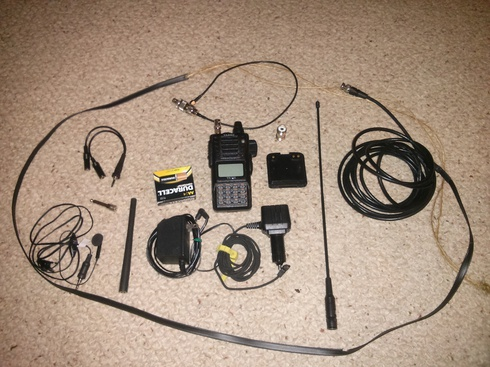

# Go Kit *(by AI4UR-George Olive)*

Here is a sample ham radio gokit. This is the kit that was shown in the September 2014 ARES meeting.

Everything except blankets, water & the first aid kit will fit in a small tool bag.

**Note: _Not everything on the list is in the pictures._**

## Radio

* HT
* Antennas
  * 5/8 wavelength antenna (to replace rubber ducky)
  * antenna (twinlead jpole)
  * rubber ducky
* Car charger for HT
* Wall charger for HT
* adapters
* coax
* AA Cell Battery holder (if one is made for your radio)
* Batteries
* headphone & microphone

## Power Accessories

* 12v charger (crank/solar/generator/wall adapter)
* fuses
* <a href="images/gkcord.jpg" alt="gkcord" style="width: 100%">12v adapter extension (w/power poles)</a>
* 12v battery cable w/powerpole connectors
* 12v cable w/powerpole connectors
* 12v usb charger
* phone charging cable

## Tools
* extension cord
* pliers (to turn off utilities)
* swiss army knife
* rope
* tarp

## First Aid
* first aid kit
* water
* food
* prescriptions
* blankets

## Misc
* license
* flashlight
* manuals *(you can keep pdf files on your phone)*

## Here are some links to other ideas for go-kits.
<https://ema.arrl.org/wp-content/uploads/2018/03/Go-Kit-Checklist.pdf>   
<https://www.scc-ares-races.org/gokit/SCCo_Go_Kit_rev160314.pdf>   
<https://www.sanctum.tech/harcstash/programs/amateur-radio-go-kit.pdf>   
<http://sacvalleyares.org/contents/ARES%20Documents/Training/GO%20Kits/Yolo%20ARES%20Go-Kit%20Suggestions.pdf>   
<http://www.n4gvk.net/guilares/ares_go_kit.pdf>   
<http://emergencyradiogokit.com/>   

## Build a J-Pole Antenna
For more information about how to build a J-Pole antenna you can go to this site: <http://www.harfordemcomm.org/files/twinlead.pdf>.
